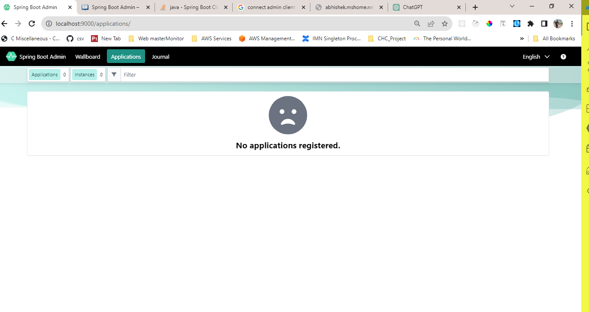
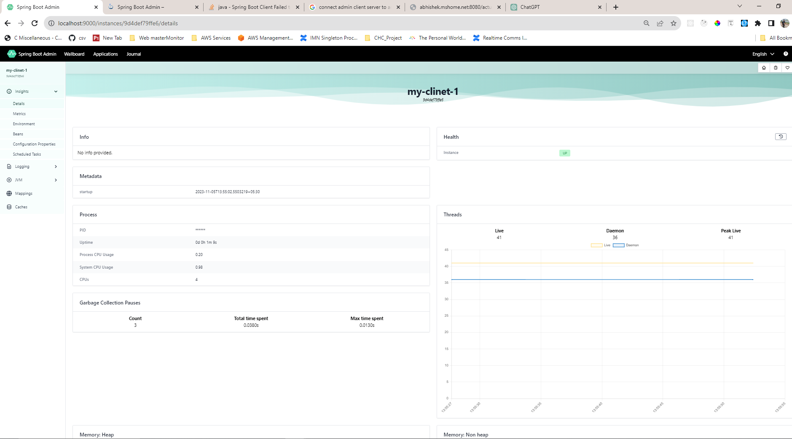

# SpringBootAdminServer

## Without any client server


[comment]: <> (https://github.com/mabhisheksingh/SpringBootAdminServer/assets/87180842/3502c667-0dbe-46b7-b835-f6d1ab712134)

## With one client-server


[comment]: <> (https://github.com/mabhisheksingh/SpringBootAdminServer/assets/87180842/f7c74a2f-822f-4d1a-a446-dd6814be76c0)

This is a Spring boot admin server to monitor and see other application **[discovery client or Admin client]** actuator data in GUI

## Config needs to change in Admin Server
```yaml
server:
  port: 9000

spring:
  application:
    name: spring-admin-server
```

## keynote while using admin client  in application
```text
If you already using Spring Cloud Discovery for your applications you don’t have to add the Spring Boot Admin Client to your applications. 
Just make the Spring Boot Admin Server a DiscoveryClient, the rest is done by our AutoConfiguration.

The following steps are for using Eureka, but other Spring Cloud Discovery implementations are supported as well. 
There are examples using Consul and Zookeeper.

Also, have a look at the Spring Cloud documentation.
```

## Config needs to change in Admin client side
#### Define port and server in the client  
```yaml
server:
  port: 8081
  address: 127.0.0.1

```
#### Define the admin server URL and out instance name on the client side.
```yaml
spring:
  boot:
    admin:
      client:
        auto-registration: true
        enabled: true
        url: http://localhost:9000
        instance:
          name: my-client-1
  application:
    name: WebFluxSpringApplication

```
#### Need admin client dependency on client side
```xml
<?xml version="1.0" encoding="UTF-8"?>
<project xmlns="http://maven.apache.org/POM/4.0.0" xmlns:xsi="http://www.w3.org/2001/XMLSchema-instance"
	xsi:schemaLocation="http://maven.apache.org/POM/4.0.0 https://maven.apache.org/xsd/maven-4.0.0.xsd">
	<modelVersion>4.0.0</modelVersion>
	<parent>
		<groupId>org.springframework.boot</groupId>
		<artifactId>spring-boot-starter-parent</artifactId>
		<version>3.1.6-SNAPSHOT</version>
		<relativePath/> <!-- lookup parent from repository -->
	</parent>
	<groupId>com.example</groupId>
	<artifactId>demo</artifactId>
	<version>0.0.1-SNAPSHOT</version>
	<name>demo</name>
	<description>Demo project for Spring Boot</description>
	<properties>
		<java.version>17</java.version>
		<spring-boot-admin.version>3.1.5</spring-boot-admin.version>
	</properties>
	<dependencies>
		<dependency>
			<groupId>de.codecentric</groupId>
			<artifactId>spring-boot-admin-starter-client</artifactId>
		</dependency>

		<dependency>
			<groupId>org.springframework.boot</groupId>
			<artifactId>spring-boot-starter-test</artifactId>
			<scope>test</scope>
		</dependency>
	</dependencies>
	<dependencyManagement>
		<dependencies>
			<dependency>
				<groupId>de.codecentric</groupId>
				<artifactId>spring-boot-admin-dependencies</artifactId>
				<version>${spring-boot-admin.version}</version>
				<type>pom</type>
				<scope>import</scope>
			</dependency>
		</dependencies>
	</dependencyManagement>

	<build>
		<plugins>
			<plugin>
				<groupId>org.springframework.boot</groupId>
				<artifactId>spring-boot-maven-plugin</artifactId>
				<configuration>
					<image>
						<builder>paketobuildpacks/builder-jammy-base:latest</builder>
					</image>
				</configuration>
			</plugin>
		</plugins>
	</build>
	<repositories>
		<repository>
			<id>spring-milestones</id>
			<name>Spring Milestones</name>
			<url>https://repo.spring.io/milestone</url>
			<snapshots>
				<enabled>false</enabled>
			</snapshots>
		</repository>
		<repository>
			<id>spring-snapshots</id>
			<name>Spring Snapshots</name>
			<url>https://repo.spring.io/snapshot</url>
			<releases>
				<enabled>false</enabled>
			</releases>
		</repository>
	</repositories>
	<pluginRepositories>
		<pluginRepository>
			<id>spring-milestones</id>
			<name>Spring Milestones</name>
			<url>https://repo.spring.io/milestone</url>
			<snapshots>
				<enabled>false</enabled>
			</snapshots>
		</pluginRepository>
		<pluginRepository>
			<id>spring-snapshots</id>
			<name>Spring Snapshots</name>
			<url>https://repo.spring.io/snapshot</url>
			<releases>
				<enabled>false</enabled>
			</releases>
		</pluginRepository>
	</pluginRepositories>

</project>
```

**Not the relative path images will not upload in JIO network**
